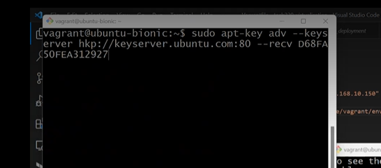
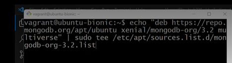
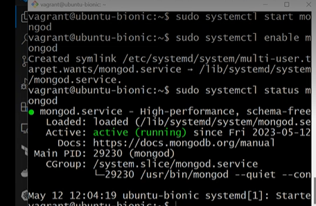
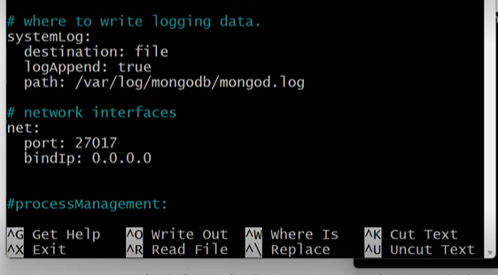
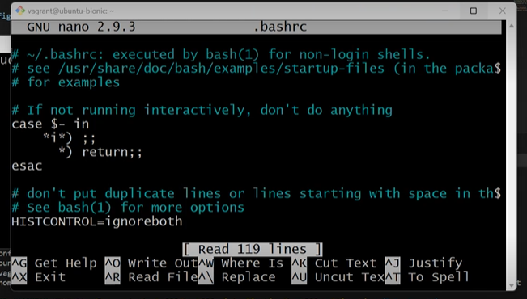
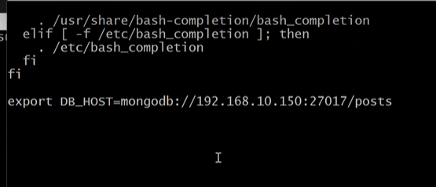
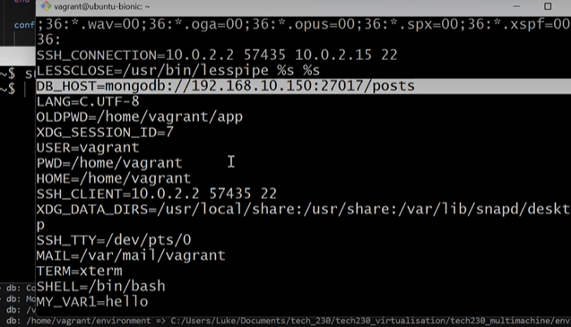
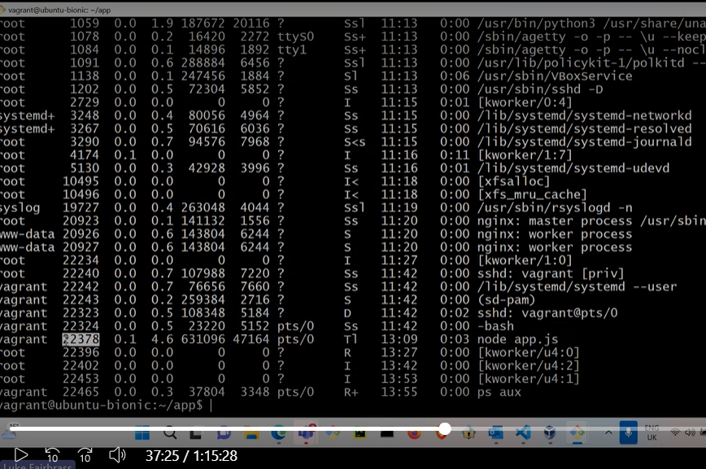
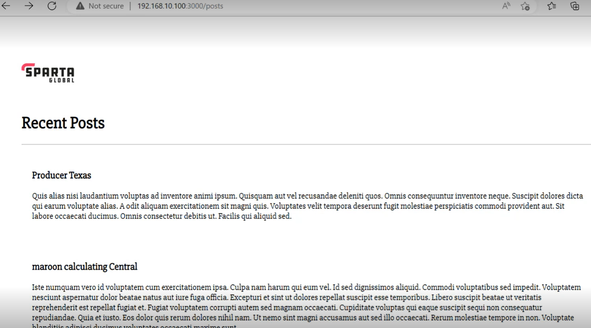
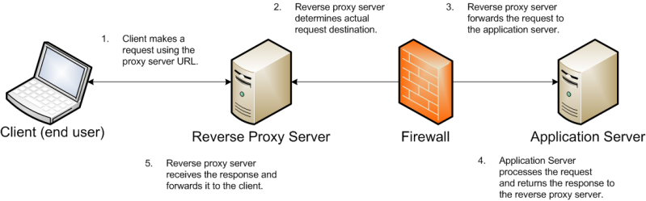

### Preparation
1. First, download the zipped folders: 'app' and 'environment'
2. Unzip the files by right clicking on folders and selecting 'extract all'
3. Make sure that you copy and paste these folders into the right location. For this 'project', mine was app_deployment

### Setting up Vagrant and provision files
1. create a vagrant file (vagrant innit)
2. create a provision file. To do this add a new file in the right location and name it provision.sh
3. Copy over the scripts from the previous vagrant and provision files, and paste them into the retrospective files. 

Your vagrant file should look like this:


Your provision file should look like this:


### Adding app folder from local machine to VM
1. To your vagrant file add a line saying:

```
config.vm.synced_folder "app", "/home/vagrant/app"
```


**note** - If you make a change locally, it will also do the change in your VM. Changes to your VM will also occur locally.

### Next steps to deploy the app
1. In git bash, cd to the right location

```
e.g., cd app_deployment
```

2. type 'ls' to make sure that the app is showing (add image)
3. In vscode, type:

```
cd environment

```

4. type 'ls' again to see if 'spec-tests' appears
5. If you have ruby installed, you can type 'gem install bundler'
6. Next, type 'bundle'
7. Follow this with rake spec.

**Note** - steps 5-7 will let you see all the dependencies that are required for the app, including what you already have and do not have (failures).


### Downloading the missing dependencies

for the sparta app, we were missing the package 'nodejs' (including the right version of it) and the package 'pm2'. The next section will go through how to add these dependencies


### Downloading nodejs

1. in git bash, type:

```
sudo apt-get install nodejs -y
```

2. Check that this has worked by typing 'rake spec' in vscode bash terminal (again only if you have ruby installed)

3. To get the right version of nodejs use the following codes, one-by-one, in git bash: 

```
sudo apt-get install python-software-properties

curl -sL https://deb.nodesource.com/setup_6.x | sudo -E bash -

sudo apt-get install nodejs -y

```

4. Again, type 'rake spec' into vscode. In this case, you should only see 1 more failure left (which is to install pm2)


### Download pm2

1. in bash, type 'install pm2' (this is the process manager)
2. Follow this with:

```
sudo npm install pm2 -g 

(the -g means make it available globally)

```

3. Do final 'rake spec' in visual code. You should expect to see no more failures

4. Type 'ls' in bash to see if 'app' is there
5. If so, type:

```
 'cd app'
```
6. follow this with:

```
'npm install' (this is the pack manager)
```

7. Finally, type:

```
 node app.js
```

To test that you app has been deployed, in a web browser, type in your ip address, followed by the port number that is displayed in git bash 


### Adding to our provision.sh to get the app dependencies installed prior before entering VM

To your provision script, add the following lines:

```
sudo apt-get install python-software-properties -y 

curl -sL https://deb.nodesource.com/setup_6.x | sudo -E bash -

sudo apt-get install nodejs -y

sudo npm install pm2 -g

cd /home/vagrant/app 

npm install

node app.js
```

This will automate the previous steps of downloading nodejs (and the right version of it), pm2, and npm. But as a DevOps engineer, you should always do everything step-by-step before you automate a process. 


This is how your provision.sh file should look like at the end:


### Adding two VMs
1. Create  new folder e.g., tech230_multimachine. In this folder, copy across the vagrant and provision.sh files that we created previously. We will be making changes to these two files to create a VM for 'app' and a VM for 'db' (data base). You should also copy across the app and environment folders that we downloaded previously.

2. Alter your vagrant file so that it looks like this:


**note** make sure that each 'end' is in the right places for their associated 'do' (as seen in the image above).

4. Your provision.sh should look like this:


As illustrated in the above image, comment out the last few lines so that they do not run. 

5. In a VSCode bash terminal, locate to where you saved your new folder (tech230_multimachine). 
Next type 'vagrant up'. This will start creating both of your VMs and may tke a few minutes. 

6. Open two seperate git bash terminals, and locate to tech230_multimachine on both. One bash terminal will be used for the app VM and the other will be for the db VM. 

7. In one terminal, type 'vagrant ssh app'. This terminal will be for the app VM. In the other terminal, type 'vagrant ssh db'. This will be for our db VM. 


### DB Bash Terminal
1. First, type:
```
sudo apt-get update -y
```
2. Follow with:
```
sudo apt-get upgrade -y
```
3. Once this has been completed, add the following line:


This will add the key needed for MongoDB

4. Follow this with:


This will set where we install MongoDB from

5. type 'sudo apt-get update -y', followed by 'sudo apt-get upgrade -y' again to grab all the MongoDB updates and implement them.

6. (optional) you can use 'mongod --version' to check if you have the right version

8. Type
```
sudo systemctl start mongod
```
followed by:

```
sudo systemctl enable mongod
```

and finally:

```
sudo systemctl status mongod
```

'enable' means that multiple people can access

You terminal should then tell you that it is active:




### Connecting the VMs 

1. First we need to go into Mongo's configuration. Type:
```
sudo nano /etc/mongod.conf
```
2. In the terminal, scroll all the way to the bottom of the outputs displayed, and change it so that the bindIp says 0.0.0.0


This allows access from any IP address. If live, you would not want this for security reasons.

3. sudo systemctl restart mongod - to put changes in places
4. sudo systemctl enable mongod 

App VM bash terminal

1. Make a environment variable by entering:
```
export my_var2=anfkasnf
```

**note** - use printenv to see environment variables

2. Make variable persistant (so that it does not disappear when you leave the session). To do this type:
```
sudo nano .bashrc
```

You should see the following:


Scroll all the way to the bottom of the output and add the following line:


then save and exit.


3. Run the file and add changes by typing: 
```
source .bashrc
```

4. Type 'printev' and you should be anle to find this 



5. Exit out and make sure you are still in the right place i.e. app. then type 'npm install'

6. if it seeds on its own, you will see it say on the output somewhere ' Database Seeded' and 'Database Cleared'. If it does not do this automatically, type:
```
node seeds/seed.js
```
this will put all the data from mongodb into the app

7. Then start the app by typing:
```
node app.js
```

8. if the port e.g. port 3000 is in use, use ps aux, find the line that shows where node app. js is and eneter the number frim the second coloumn after 'sudo kill' e.g. 'sudo kill 22378'. Then use 'node app.js' again to start it. 



9. 
To check that your posts page is working, in a web broswer type:
```
192.168.10.100.3000/posts
```

You should then see a page like this:



### Nginx reverse proxy research

## What are ports?
- These are numeric values that helps us to identify specific processes or servives on a computer network 

## What is a reverse proxy?
- This is a server that sits behind the firewall of a private netwok and directs requests from clients to the right backend server. It provides more control and promotes the smooth flow of network traffic between clients and servers. 
- A proxy/ 'forward' proxy, sits in fronty of the clients, whereas a reverse proxy is a server that sits in front of one ot more web servers, intercepting requests from clients. Reverse proxy provides identity protection for servers 



## Nginx configuration
By default, Nginx provides a file 
```
/etc/nginx/site-available/default
```
 that you can modify. Within the sites available directory, the two files of importance are 'default' and 'example.com' (or a similar filename)

 ### Setting up Nginx as a reverse proxy 

Make sure that your VM's are running and linked and that node js is installed

 1. In your app bash terminal, type:
 ```
 sudo nano /etc/nginx/sites-available/default
 ```

 2. Then scroll down to where it says server and location. Replace the underscore after 'server' with your ip adress. For the sparta app, this would look like:
 ```
 server_name 192.168.10.100;

```

3. Next, edit the location box so that the reverse proxy will pass the requests from the ip to the port that our app is listening on:

```
     location / {
        proxy_pass http://localhost:3000;
        proxy_http_version 1.1;
        proxy_set_header Upgrade $http_upgrade;
        proxy_set_header Connection 'upgrade';
        proxy_set_header Host $host;
        proxy_cache_bypass $http_upgrade;
    }
}
```

We can also add another location block to give acces to our ports page by out MongoDB server:
```
     location /posts {
        proxy_pass http://localhost:3000/posts;
        proxy_http_version 1.1;
        proxy_set_header Upgrade $http_upgrade;
        proxy_set_header Connection 'upgrade';
        proxy_set_header Host $host;
        proxy_cache_bypass $http_upgrade;
    }
}
```

make sure you save and exit editor

3. To check for syntax errors, type: 'sudo nginx -t'
4. sudo systemctl restart nginx
5. Restart Nginx using:
```
 sudo systemctl restart nginx
```

6. If the connection between the app and db VMs were established correctly, navigate to your app folder (cd into app), and start the app using:
```
node app.js
```

7. To test that everything is working, type 192.168.10.100 into a web browser, and you should see the same sparta app page. 


### change to show ssh working