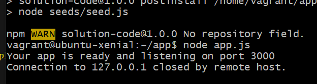

### Preparation
1. First, download the zipped folders: 'app' and 'environment'
2. Unzip the files by right clicking on folders and selecting 'extract all'
3. Make sure that you copy and paste these folders into the right location. For this 'project', mine was app_deployment

### Setting up Vagrant and provision files
1. create a vagrant file (vagrant innit)
2. create a provision file. To do this add a new file in the right location and name it provision.sh
3. Copy over the scripts from the previous vagrant and provision files, and paste them into the retrospective files. 

Your vagrant file should look like this:


Your provision file should look like this:


### Adding app folder from local machine to VM
1. To your vagrant file add a line saying:

```
config.vm.synced_folder "app", "/home/vagrant/app"
```


**note** - If you make a change locally, it will also do the change in your VM. Changes to your VM will also occur locally.

### Next steps to deploy the app
1. In git bash, cd to the right location

```
e.g., cd app_deployment
```

2. type 'ls' to make sure that the app is showing (add image)
3. In vscode, type:

```
cd environment

```

4. type 'ls' again to see if 'spec-tests' appears
5. If you have ruby installed, you can type 'gem install bundler'
6. Next, type 'bundle'
7. Follow this with rake spec.

**Note** - steps 5-7 will let you see all the dependencies that are required for the app, including what you already have and do not have (failures).


### Downloading the missing dependencies

for the sparta app, we were missing the package 'nodejs' (including the right version of it) and the package 'pm2'. The next section will go through how to add these dependencies


### Downloading nodejs

1. in git bash, type:

```
sudo apt-get install nodejs -y
```

2. Check that this has worked by typing 'rake spec' in vscode bash terminal (again only if you have ruby installed)

3. To get the right version of nodejs use the following codes, one-by-one, in git bash: 

```
sudo apt-get install python-software-properties

curl -sL https://deb.nodesource.com/setup_6.x | sudo -E bash -

sudo apt-get install nodejs -y

```

4. Again, type 'rake spec' into vscode. In this case, you should only see 1 more failure left (which is to install pm2)


### Download pm2

1. in bash, type 'install pm2' (this is the process manager)
2. Follow this with:

```
sudo npm install pm2 -g 

(the -g means make it available globally)

```

3. Do final 'rake spec' in visual code. You should expect to see no more failures

4. Type 'ls' in bash to see if 'app' is there
5. If so, type:

```
 'cd app'
```
6. follow this with:

```
'npm install' (this is the pack manager)
```

7. Finally, type:

```
 node app.js
```

To test that you app has been deployed, in a web browser, type in your ip address, followed by the port number that is displayed in git bash 




### Adding to our provision.sh to get the app dependencies installed prior before entering VM

To your provision script, add the following lines:

```
sudo apt-get install python-software-properties -y 

curl -sL https://deb.nodesource.com/setup_6.x | sudo -E bash -

sudo apt-get install nodejs -y

sudo npm install pm2 -g

cd /home/vagrant/app 

npm install

node app.js
```

This will automate the previous steps of downloading nodejs (and the right version of it), pm2, and npm. But as a DevOps engineer, you should always do everything step-by-step before you automate a process. 

This is how your provision.sh file should look like at the end:

